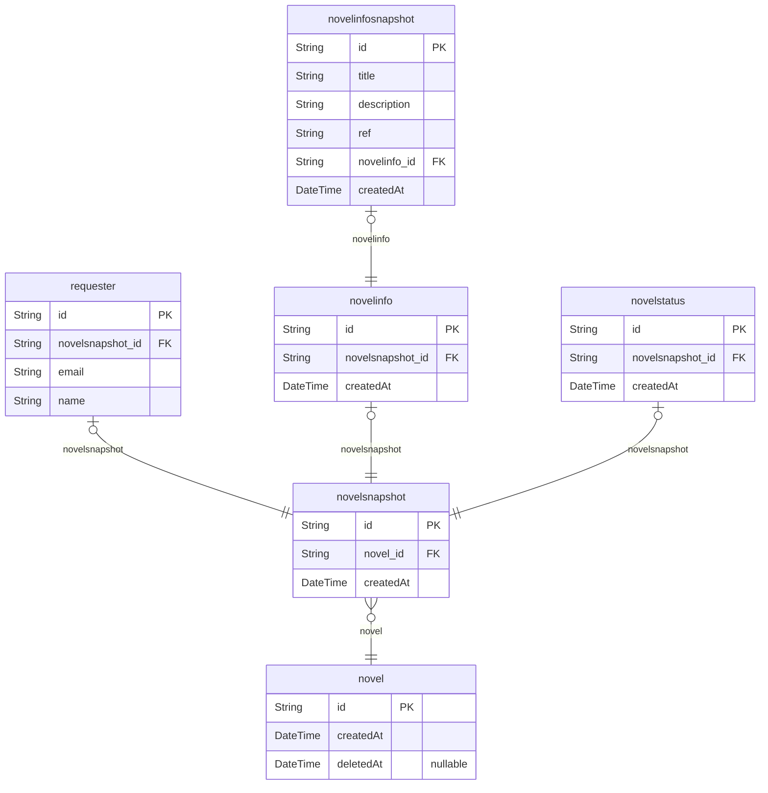
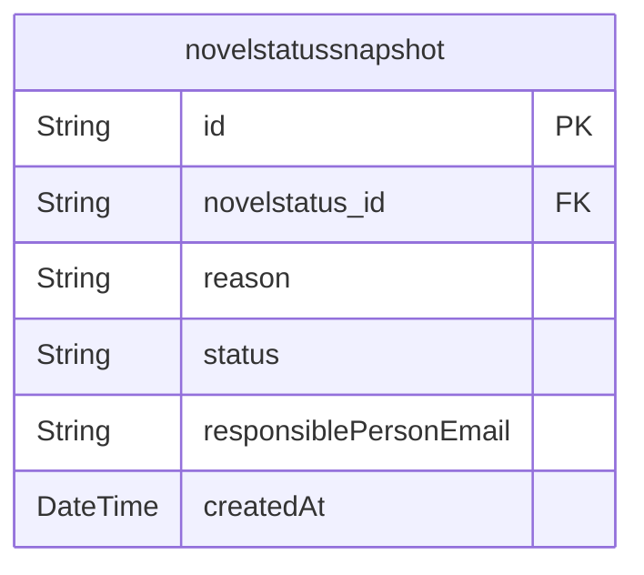

# Eatbook Community
> Generated by [`prisma-markdown`](https://github.com/samchon/prisma-markdown)

- [Novel](#novel)
- [default](#default)

## Novel

### `novel`
소설 테이블은 최초 요청 시, 생성 되며 이후에 오는 중복된 요청은 snapshot에 기록됩니다.

**Properties**
  - `id`
    > PK
    > 
    > 소설을 식별하기 위한 고유 번호
  - `createdAt`: 최초 소설 등록 요청일
  - `deletedAt`: 소설 등록 요청 삭제 일

### `novelsnapshot`
소설 등록 요청을 snapshot으로 만들어 타임라인 순서대로 저장해 유지 보수와 데이터 추적에 용이하도록 합니다.

같은 소설을 다른 사용자가 요청하거나 처리상태, 소설 입력 정보를 롤백해야 할 경우에도 용이합니다.

특정 소설에 대한 모든 요청을 snapshot으로 저장하는 특성을 활용하여 가장 많은 요청을 받은 소설,
사람들의 관심을 가장 많이 받고 있는 소설 등 확장에 가능성을 두고 설계하였습니다.

**Properties**
  - `id`: PK
  - `novel_id`: 해당 snapshot과 연결되어 있는 소설의 고유 식별자 입니다. (@link novel.id)
  - `createdAt`: 소설 등록 요청일 입니다.

### `requester`
소설 등록 요청자의 정보입니다.

**Properties**
  - `id`: PK
  - `novelsnapshot_id`: 소설 등록 요청자와 연결되어 있는 snapshot의 고유 식별자 입니다. (@link novelsnapshot.id)
  - `email`: 소설 등록 요청자의 이메일 주소입니다.
  - `name`: 소설 요청자의 이름입니다.

### `novelinfo`
등록 요청한 소설의 정보입니다.

**Properties**
  - `id`: PK
  - `novelsnapshot_id`: 소설 정보와 연결되어 있는 snapshot의 고유 식별자 입니다. (@link novelsnapshot.id)
  - `createdAt`: 최초 소설 정보를 등록한 일입니다.

### `novelinfosnapshot`
위에 기술한 바와 같이 유지 보수와 데이터 추적에 용이하도록 소설 정보 변경 이력을 snapshot 단위로 저장합니다.

**Properties**
  - `id`: PK
  - `title`: 소설의 제목입니다.
  - `description`
    > 소설의 줄거리입니다.
    > 
    > 공백을 포함해 200자까지 입력을 받습니다.
  - `ref`
    > 참고한 소설 페이지 주소입니다.
    > 
    > 저작권 및 데이터 추출을 위해 사용되며, 반드시 입력받아야 합니다.
  - `novelinfo_id`: 해당 snapshot과 연결되어 있는 소설 정보의 고유 식별자 입니다. (@link novelinfo.id)
  - `createdAt`: 소설 정보를 등록한 일입니다.

### `novelstatus`
소설 등록 요청 처리를 위한 테이블 입니다.

**Properties**
  - `id`: PK
  - `novelsnapshot_id`: 소설 정보와 연결되어 있는 snapshot의 고유 식별자 입니다. (@link novelsnapshot.id)
  - `createdAt`: 최초 소설 요청 처리를 등록한 일입니다.

## default

### `novelstatussnapshot`

**Properties**
  - `id`: PK
  - `novelstatus_id`: 해당 snapshot과 연결되어 있는 소설 등록 요청 상태의 고유 식별자 입니다. (@link novelinfo.id)
  - `reason`
    > 소설 등록 요청 결과에 대한 사유입니다.
    > 
    > 정상 처리에 경우 "완료"와 같은 형식 통일이 필요합니다.
  - `status`: 소설 등록 요청 상태입니다.
  - `responsiblePersonEmail`: 소설 등록 요청 처리를 한 담당자의 이메일 주소입니다.
  - `createdAt`: 소설 요청 처리를 등록한 일입니다.