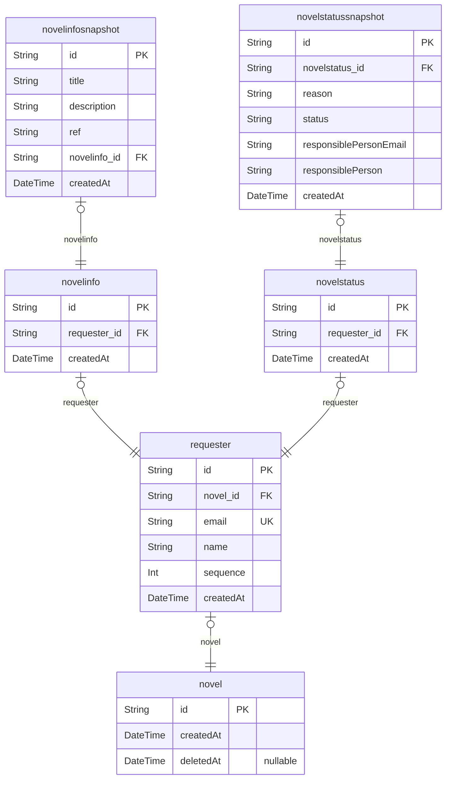

# Eatbook Community
> Generated by [`prisma-markdown`](https://github.com/samchon/prisma-markdown)

- [Novel](#novel)

## Novel

### `novel`
UCI를 PK로 사용하며, 해당 소설 등록 요청한 사용자들을 requester로 묶어 관리하고 있습니다.
이 구조는 Novel 조회와 Requester 조회를 분리하여 관리자는 모든 소설에 대한 정보를,
사용자는 자신이 등록한 소설의 정보를 확인할 수 있도록 설계되었습니다.

**Properties**
  - `id`
    > PK
    > 
    > 소설을 식별하기 위한 고유 번호
  - `createdAt`: 최초 소설 등록 요청일
  - `deletedAt`: 소설 등록 요청 삭제 일

### `requester`
소설 등록 요청자의 정보입니다.

하나의 소설에 여러 사용자가 등록 요청을 할 수 있습니다.
이 구조는 하나의 소설에 대해 등록 요청한 여러 사용자의 이력을 추적할 수 있습니다.

**Properties**
  - `id`: PK
  - `novel_id`: 소설 등록 요청자와 연결되어 있는 소설의 고유 식별자 입니다. [novel.id](#novel)
  - `email`: 소설 등록 요청자의 이메일 주소입니다.
  - `name`: 소설 요청자의 이름입니다.
  - `sequence`
    > 소설 등록 요청한 순서 입니다.
    > 1값을 가진 등록자가 최초 소설 등록 요청한 사람입니다.
  - `createdAt`: 소설 등록 요청한 일입니다.

### `novelinfo`
등록 요청한 소설의 정보입니다.

최초 요청자를 제외한 추가 요청자는 해당 테이블의 값이 항상 null입니다.

**Properties**
  - `id`: PK
  - `requester_id`: 소설 정보와 연결되어 있는 snapshot의 고유 식별자 입니다. [novelsnapshot.id](#novelsnapshot)
  - `createdAt`: 최초 소설 정보를 등록한 일입니다.

### `novelinfosnapshot`
위에 기술한 바와 같이 유지 보수와 데이터 추적에 용이하도록 소설 정보 변경 이력을 snapshot 단위로 저장합니다.
소설 정보는 사용자가 언제나 변경 및 수정할 수 있습니다.

**Properties**
  - `id`: PK
  - `title`: 소설의 제목입니다.
  - `description`
    > 소설의 줄거리입니다.
    > 
    > 공백을 포함해 200자까지 입력을 받습니다.
  - `ref`
    > 참고한 소설 페이지 주소입니다.
    > 
    > 저작권 및 데이터 추출을 위해 사용되며, 반드시 입력받아야 합니다.
  - `novelinfo_id`: 해당 snapshot과 연결되어 있는 소설 정보의 고유 식별자 입니다. [novelinfo.id](#novelinfo)
  - `createdAt`: 소설 정보를 등록한 일입니다.

### `novelstatus`
소설 등록 요청 처리를 위한 테이블 입니다.

최초 요청자를 제외한 추가 요청자는 해당 테이블의 값이 항상 null입니다.

**Properties**
  - `id`: PK
  - `requester_id`: 소설 정보와 연결되어 있는 snapshot의 고유 식별자 입니다. [novelsnapshot.id](#novelsnapshot)
  - `createdAt`: 최초 소설 요청 처리를 등록한 일입니다.

### `novelstatussnapshot`
위에 기술한 바와 같이 유지 보수와 데이터 추적에 용이하도록 소설 정보 변경 이력을 snapshot 단위로 저장합니다.
요청 처리 결과는 변경 될 수 있으며, 특정한 시점으로 데이터를 변경해야할 수 있습니다.

**Properties**
  - `id`: PK
  - `novelstatus_id`: 해당 snapshot과 연결되어 있는 소설 등록 요청 상태의 고유 식별자 입니다. [novelinfo.id](#novelinfo)
  - `reason`
    > 소설 등록 요청 결과에 대한 사유입니다.
    > 
    > 정상 처리에 경우 "완료"와 같은 형식 통일이 필요합니다.
  - `status`: 소설 등록 요청 상태입니다.
  - `responsiblePersonEmail`: 소설 등록 요청 처리를 한 담당자의 이메일 주소입니다.
  - `responsiblePerson`: 소설 등록 요청 처리를 한 담당자의 이름입니다.
  - `createdAt`: 소설 요청 처리를 등록한 일입니다.